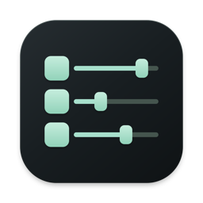
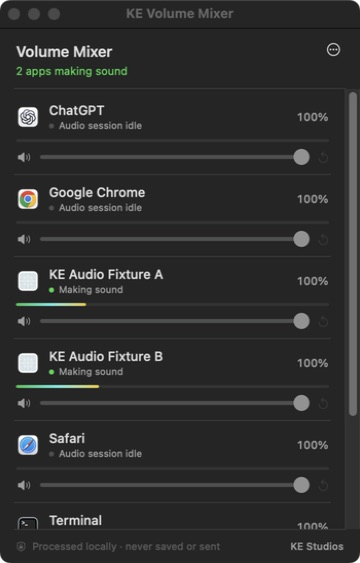

<p align="center"></p>

<h1 align="center">KE Volume Mixer</h1>

<p align="center"><b>A Windows-level volume mixer for Mac.</b><br>
Per-app volume, mute and live meters in the menu bar. Free and open source.</p>

<p align="center">
  <a href="https://github.com/willykeenan/volume-mixer/releases/latest"><b>Download for Mac</b></a> ·
  <a href="https://huggingface.co/spaces/willykeenan/volume-mixer">Product page</a> ·
  <a href="PRIVACY.md">Privacy</a>
</p>

<p align="center"></p>
<p align="center"><sub>The real app during release QA. "KE Audio Fixture" A and B are the test-tone apps built by <code>scripts/build-qa-fixtures.zsh</code>.</sub></p>

KE Volume Mixer lives in the menu bar. It lists every app with an audio
session, marks the ones actually producing sound, and gives each one a
volume slider, mute, reset and a live meter. Levels are remembered per app
and follow you when you switch output devices.

- **Native and small.** SwiftUI and Core Audio, a 1.8 MB universal download for Apple silicon and Intel.
- **No driver.** Uses Apple's Core Audio process taps (macOS 14.4+). No virtual audio device, kernel extension or restart.
- **Private.** Audio is processed in memory and never saved or sent. No network client, account, analytics or telemetry.

## Install

1. Download `KE-Volume-Mixer-<version>-universal-preview.dmg` from the
   [latest release](https://github.com/willykeenan/volume-mixer/releases/latest)
   and drag the app to Applications.
2. The Preview is ad-hoc signed and not notarized, so Control-click the app
   and choose **Open**. If macOS offers only **Done**, open
   **System Settings › Privacy & Security** and choose **Open Anyway**.
3. Allow **Screen & System Audio Recording** when macOS asks. The app reads
   app output buffers to meter and adjust them. It never captures the screen.
4. Click the speaker icon in the menu bar. Turn on **Launch at Login
   (Preview)** from the ⋯ menu if you want it every day.

Verify the download against the `.sha256` file on the release page:

```zsh
shasum -a 256 KE-Volume-Mixer-0.1.2-universal-preview.dmg
```

`READ ME — Preview.txt` inside the DMG covers removal and rollback.

## Requirements and limits

- macOS 14.4 or later.
- Browser audio is grouped by browser. Core Audio doesn't expose separate
  streams per tab.
- Apps that take exclusive control of a device (HAL hog mode) bypass the
  shared mixer.
- The mixer only turns apps down: 100% is the app's own level.

## How it works

For each app you adjust, the mixer creates a private Core Audio process tap
that mutes the app's original output, applies your gain in the real-time
callback (ramped, with lock-free atomic state), and plays the result to the
current default output device through a private aggregate device. Taps are
rebuilt when the output device changes or Core Audio restarts, and torn down
when the app quits.

| Path | What it is |
| --- | --- |
| `Sources/KEVolumeMixer` | Menu-bar app: mixer model, process taps, views, Launch at Login |
| `Sources/MixerCore` | Allocation-free gain ramp and meter math, shared with the tests |
| `Sources/MixerAtomics` | Lock-free atomic float used by the audio callback |
| `Tests` | XCTest suites for DSP, Core Audio ownership and the LaunchAgent guard |
| `scripts` | Build, package, QA fixtures and source checks |

## Build from source

Requires Xcode 15.3+ (Swift 5.9+).

```zsh
swift test                    # unit tests
./scripts/verify-local.zsh    # source checks, tests, universal build, signature and link checks
./scripts/package-preview.zsh # ad-hoc signed Preview DMG + .sha256 + manifest in dist/
```

The app bundle is written to `dist/KE Volume Mixer.app`. With no Developer ID
certificate in your keychain, `build-app.zsh` signs ad-hoc for local use.
`verify-local.zsh` also fails if the source gains a network, telemetry or
recording primitive, or if the audio callback gains a lock or allocation.

### Developer ID and notarization

The notarized path stays fail-closed until you supply credentials:

```zsh
export KE_MIXER_SIGNING_IDENTITY="Developer ID Application: …"
export KE_MIXER_NOTARY_PROFILE="your-notarytool-profile"
./scripts/package-notarized.zsh
```

A Developer ID build registers Launch at Login with `SMAppService` instead of
the Preview's LaunchAgent.

## Launch at Login (Preview)

An ad-hoc build can't register `SMAppService.mainApp`, so the Preview toggle
writes exactly one current-user file,
`~/Library/LaunchAgents/dev.kestudios.volume-mixer.login.plist`. It holds only
the label, the exact `/Applications/KE Volume Mixer.app/Contents/MacOS/KEVolumeMixer`
path and `RunAtLoad`. No `KeepAlive`, shell, network, helper or elevated
privilege. The app re-verifies the file's owner, mode and contents, fails
closed if it drifts, and removes it when you turn the setting off.
`scripts/verify-preview-launch-agent.zsh` checks it read-only.

## License and credits

MIT. See [LICENSE](LICENSE).

The process-tap foundation is derived from [dB](https://github.com/routsiddharth/dB)
by Siddharth Rout (MIT) at the pinned revision in
[THIRD_PARTY_NOTICES.md](THIRD_PARTY_NOTICES.md) and
[provenance.json](provenance.json).

Made by [K&E Studios](https://kestudios.dev/).
